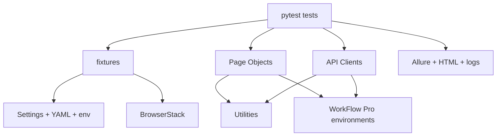

# Architecture

## Design Goals

- Keep browser tests readable through Page Object Model classes.
- Keep API operations reusable and tenant-aware.
- Keep framework code inside an installable `src/workflowpro_qa` package.
- Keep test data isolated, generated, and cleaned up.
- Keep environment differences outside test code.
- Keep reporting useful for local debugging and CI failures.

## Repository Layout

```text
WorkFlow-Pro/
├── config/                     Runtime YAML and environment configuration
├── docs/                       Design, execution, and submission documentation
├── src/workflowpro_qa/         Reusable QA automation framework package
│   ├── api/                    API layer
│   ├── browserstack/           Remote execution layer
│   ├── config/                 Python settings loader
│   ├── fixtures/               pytest lifecycle and dependency injection
│   ├── pages/                  Page Object Model
│   └── utils/                  Shared utilities
├── test_data/                  Non-secret data templates
└── tests/                      Test suites grouped by execution type
```

## Layers



## SOLID Application

- Single Responsibility: pages model UI behavior, API clients model service calls, fixtures manage lifecycle.
- Open/Closed: add a new tenant, role, browser, or device through config without changing test logic.
- Liskov Substitution: page objects share `BasePage` behavior and remain usable wherever a Playwright page is supplied.
- Interface Segregation: tests depend only on focused fixtures like `project_client` or `app_page`.
- Dependency Inversion: test code receives settings, browser sessions, and clients through fixtures.

## Enterprise Choices

- `expect` assertions instead of immediate state reads for UI synchronization.
- Generated project names to avoid collisions in parallel CI.
- API cleanup through client utilities to avoid polluted shared environments.
- Tenant identity always passed explicitly through `X-Tenant-ID`.
- BrowserStack sessions are isolated per test and marked with pass/fail status.
- `src` layout prevents accidental imports from the working directory and mirrors client Python repositories.
